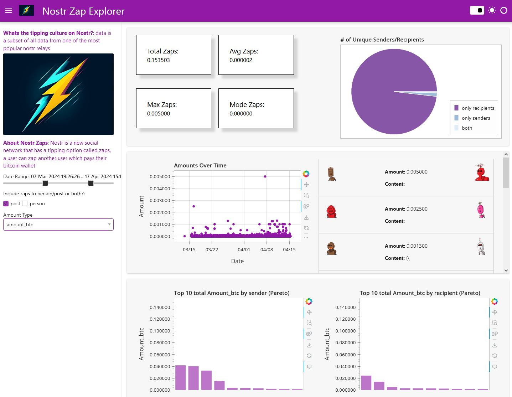
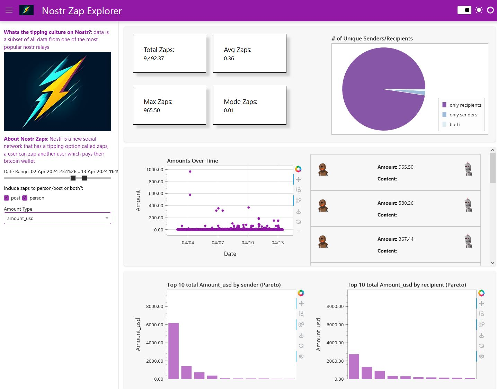
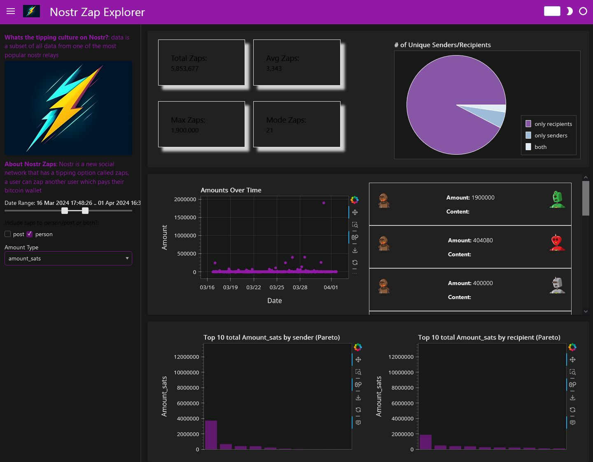

# Nostr Zap Analysis: Panel Dashboard

## Description

Tipping is a novel feature on Nostr(see https://nostr.com/ or https://github.com/nostr-protocol/nips/blob/master/57.md for zaps specifically). This dashboard provides a view into how much money is moving and which users it's going to. 

## Features

- **Zap Sender/Recipient Visualization**: Since users are represented as a giant pubkey string, robohashes were used for better visualization. 
- **Metrics**: Overall summary metrics such as Average sent, total sent, etc for the user provided time range and selected toggles. 
- **Graphs**: Descending bar charts(pareto inspired), pie charts, and time series chart showing amount sent over time help visualize tip culture.
- **User Inputs**: User can provide time range, whether zaps were to a person, post, or both, and change the amount type from millisats, sats, btc, or usd. 

### Prerequisites

Python, Jupyter Lab 

### Installation

Steps to install and set up your project:
1. Clone the repository:

2. Navigate to the project directory:
    ```bash
    cd nostr-zap-dashboard
    ```
3. Optional: Virtual Env (Windows)
    ```bash
       . venv/Scripts/activate
   ```
5. Install dependencies:
    ```bash
    pip install -r requirements.txt
    ```

### Usage
Launch the app:
    ```bash
    panel serve app.ipynb --autoreload
    ```
Change the user input fields on the sidebar to see different views.


*Showing amount_btc selection*


*showing amount_usd selection*


*showing dark mode*

